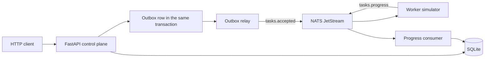

# Tenant provisioning control plane

A FastAPI service records tenants, persists an asynchronous task for each mutation, and publishes that task only after the database commit. A separate worker simulates provisioning and reports `in_progress`, then `done` or `failed`. Progress is applied idempotently and never moves a task backwards.

Python 3.14. SQLite is the source of truth. NATS JetStream is the at-least-once transport.

How a request is ordered, how duplicates are absorbed, and where the race tests live is in [IMPLEMENTATION.md](IMPLEMENTATION.md).

## Architecture



The outbox row means "this task must be published". A crash after commit but before the broker ack publishes the task again.

## Run

Requires Docker Compose v2.

```bash
git clone <your-repo> && cd <your-repo>
docker compose up --build --wait
```

That builds one image, starts NATS JetStream, the API on port 8080, and the worker. The API stores tenants in `/data/controlplane.db` on the `sqlite-data` volume. Creating a tenant is enough for the worker to move it from `provisioning` to `active`.

```bash
curl -sS -X POST localhost:8080/v1/tenants \
  -H 'content-type: application/json' \
  -d '{"slug":"acme","name":"Acme"}'

curl -sS localhost:8080/v1/tenants/<tenant-id>
curl -sS "localhost:8080/v1/tasks?tenant_id=<tenant-id>"
```

```bash
docker compose down -v
```

## Tests and quality gates

Tests need Python 3.14. SQLite is a temporary file. They start NATS from a local `nats-server` (including `.tools/nats-server`) or from Docker.

```bash
python3.14 -m venv .venv
.venv/bin/pip install -e '.[dev]'
make test
```

One command runs Ruff, Bandit, the test suite, and pip-audit:

```bash
make verify
```

`scripts/concurrency.sh` fires 16 simultaneous creates of one slug against a running stack, waits until the tenant is active, then fires 16 patches of the same version. Exactly one of each succeeds.

```bash
chmod +x scripts/*.sh
./scripts/concurrency.sh
```

## Worker knobs

Flags and environment variables are read when the worker process starts. Restart it to change the scenario.

| Flag | Env | Default | Meaning |
| --- | --- | --- | --- |
| `--fail-rate` | `FAIL_RATE` | `0` | Probability a task ends `failed`, from 0 to 1 |
| `--min-delay-ms` | `MIN_DELAY_MS` | `500` | Shortest pause before each progress message |
| `--max-delay-ms` | `MAX_DELAY_MS` | `1500` | Longest pause before each progress message |
| `--nats-url` | `NATS_URL` | `nats://127.0.0.1:4222` | Broker URL |

Always fail new work, quickly:

```bash
FAIL_RATE=1 MIN_DELAY_MS=50 MAX_DELAY_MS=100 docker compose up -d --force-recreate --no-deps worker
```

Back to success:

```bash
FAIL_RATE=0 MIN_DELAY_MS=500 MAX_DELAY_MS=1500 docker compose up -d --force-recreate --no-deps worker
```

A failed deploy leaves the tenant `failed`. `DELETE` is allowed from `active` or `failed`. `PATCH` is allowed only from `active`.

## Negative cases without the worker

`python -m controlplane.publish` sends one progress message. `--update-id` is the idempotency key. Omit it to generate a new key. Pass the same key twice and the second delivery changes nothing.

```bash
chmod +x scripts/publish-progress.sh

./scripts/publish-progress.sh --task-id <task-id> --status done --update-id <task-id>:done
./scripts/publish-progress.sh --task-id <task-id> --status in_progress --update-id stale-running-1
./scripts/publish-progress.sh \
  --task-id 00000000-0000-4000-8000-000000000099 \
  --status done \
  --update-id missing-task
```

The unknown task is nacked with backoff and then terminated. Later valid updates still apply. A malformed payload is terminated immediately.

## HTTP API

Timestamps are UTC, ISO 8601, with milliseconds and a `Z` suffix. Mutating tenant calls return the tenant and the accepted task.

| Method | Path | Success | Body |
| --- | --- | --- | --- |
| `POST` | `/v1/tenants` | 201 | `{"slug","name"}` |
| `GET` | `/v1/tenants` | 200 | query: `status`, `limit` (1-100, default 20), `cursor` |
| `GET` | `/v1/tenants/{id}` | 200 | |
| `PATCH` | `/v1/tenants/{id}` | 202 | `{"name","version"}` |
| `DELETE` | `/v1/tenants/{id}` | 202 | |
| `GET` | `/v1/tasks` | 200 | query: `tenant_id`, `status`, `limit`, `cursor` |
| `GET` | `/v1/tasks/{id}` | 200 | |
| `GET` | `/healthz` | 200 | checks SQLite and NATS |

Lists are ordered by `created_at` descending, then `id`. `next_cursor` is omitted on the last page.

Slug rule: `^[a-z][-a-z0-9]{1,26}[a-z0-9]$`. Slugs stay unique, including tenants that are already `destroyed`. `name` is required, trimmed, and at most 200 characters. `version` on `PATCH` must be the version you read.

### State

Creating a tenant stores it as `provisioning` and a `deploy` task as `accepted`.

| Task outcome | Tenant move |
| --- | --- |
| deploy `done` | `provisioning` → `active` |
| deploy `failed` | `provisioning` → `failed` |
| update `done` | `updating` → `active` |
| update `failed` | `updating` → `failed` |
| destroy `done` | `destroying` → `destroyed` |
| destroy `failed` | `destroying` → `failed` |

`PATCH` is legal only from `active`. `DELETE` is legal only from `active` or `failed`. Tenant `version` increments on every tenant mutation, including a terminal worker result. `in_progress` changes the task only.

A terminal progress message is also accepted while the task is still `accepted`, so a lost `in_progress` cannot stall the tenant. A later `in_progress` is ignored.

### Errors

Every error body is `{"code","message"}`.

| Code | HTTP | When |
| --- | --- | --- |
| `validation_error` | 400 | Bad JSON, slug, name, version, limit, cursor, or id |
| `tenant_not_found` | 404 | No tenant with that id |
| `task_not_found` | 404 | No task with that id |
| `tenant_already_exists` | 409 | Slug is taken, including by a destroyed tenant |
| `tenant_version_conflict` | 409 | `PATCH` version is not the current version |
| `tenant_update_not_allowed` | 409 | `PATCH` or `DELETE` is illegal in the current status |
| `not_found` | 404 | Unknown route |
| `unavailable` | 503 | `/healthz` dependency check failed |
| `internal_error` | 500 | Unexpected failure, with no stack trace in the body |

Two `PATCH` calls that present the same version cannot both succeed. The loser gets `tenant_version_conflict`. Two creates of the same slug cannot both succeed. The loser gets `tenant_already_exists`.

```bash
curl -sS -X PATCH localhost:8080/v1/tenants/<id> \
  -H 'content-type: application/json' \
  -d '{"name":"Renamed","version":2}'
```

## Messages

Stream `PROVISIONING`, subjects `tasks.>`, file storage, 2 minute dedup window.

`tasks.accepted` is the task, published by the relay after commit:

```json
{
  "id": "task uuid",
  "type": "deploy",
  "tenant_id": "tenant uuid",
  "status": "accepted",
  "tenant_slug": "acme",
  "tenant_name": "Acme"
}
```

`tasks.progress` is the worker update. The worker's `update_id` is `<task-id>:<status>`, so a redelivery of the same outcome is stable.

```json
{
  "update_id": "<task-id>:in_progress",
  "task_id": "<task-id>",
  "status": "in_progress"
}
```

The same `update_id` applied twice changes nothing. A message that would move a terminal task, or repeat `in_progress`, is recorded and ignored. Malformed messages are terminated. Broker or database errors are nacked with backoff and terminated after repeated failure. The consumer loop reconnects if the subscription drops.

## Design choices

- **Outbox, not publish-then-commit.** Create, update, and delete write the tenant change, the task, and the outbox row in one transaction. The relay publishes only committed rows and sets `published_at` after the broker ack, in that same transaction. A rollback cannot emit an event. A crash after the ack but before the mark publishes again.
- **At-least-once.** JetStream dedup covers a short window. The `progress_updates` primary key covers the rest. The worker can be redelivered and emits the same keys.
- **Optimistic locking is the version column.** The update matches `id`, `version`, and `status = active` together. A partial unique index on open tasks is a backstop. SQLite write transactions use `BEGIN IMMEDIATE`, so two requests cannot apply the same version.
- **The requested name is stored when the update is accepted.** A failed update leaves the tenant `failed` with that name. The state machine has no path from `failed` back to `active`; the next legal call is `DELETE`.
- **The first terminal result wins.** A redelivery that rolls a different outcome is ignored.

## Layout

```text
controlplane/app.py        FastAPI app, outbox relay, progress consumer
controlplane/api.py        routes and error mapping
controlplane/service.py    use cases
controlplane/store.py      SQLite, outbox, idempotency keys
controlplane/broker.py     JetStream publish and consume
controlplane/domain.py     state machine and validation
controlplane/worker.py     provisioning simulator
controlplane/publish.py    one-shot progress publisher
```
